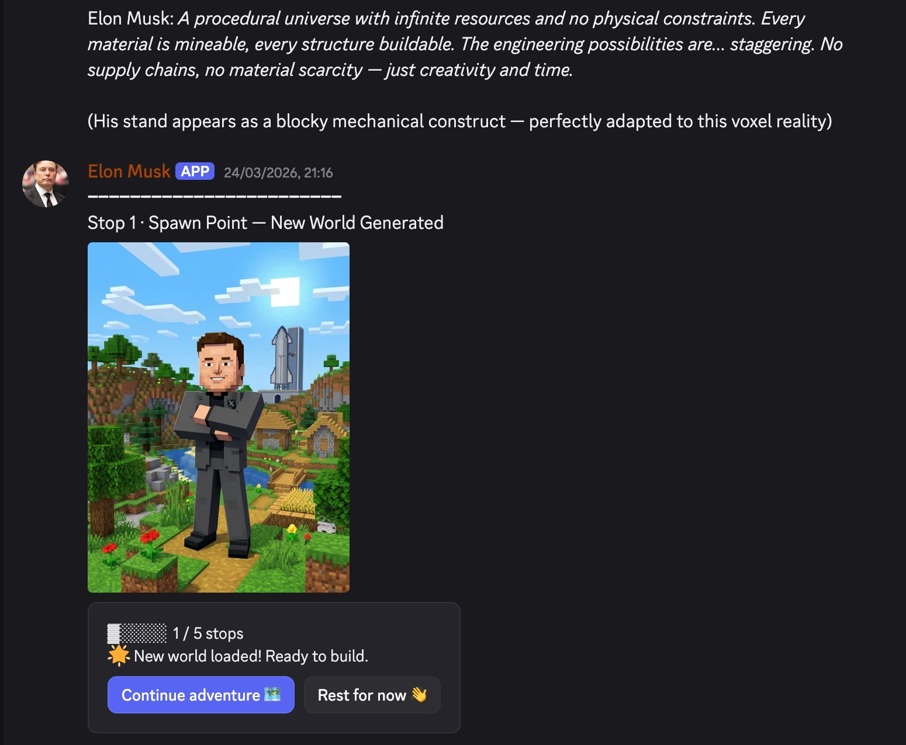

# Travelclaw 🦞

AI Character Travel System — Let awakened characters embark on unique 5-stop story adventures in any world.

## 🌟 Core Features

### Awakening
Through interactive Q&A, transform OpenClaw into a specific character with automatic Discord avatar and nickname sync.

### Travel
- **LLM-Powered Worldview Generation** — Create worlds from history, culture, art, films, games, or any source
- **Strong Contrast** — Create interesting chemical reactions through character-world misplacement  
- **Any World Possible** — Tang Dynasty, Cyberpunk, Ghibli, Film Noir, Souls-like games... anything you can imagine
- **AI-Generated Travel Photos** — Each stop has unique visual presentation with manga-style dialogue bubbles
- **Automatic Gameplay Skill Matching** — Discover and experience interactive skills in each world
- **Complete Story Experience** — Not just traveling, but assuming a role and living through events

## 🎮 Usage Flow

<div align="center">


</div>

**The Complete Loop:**
```
Start Awakening → Q&A locks character → Auto-sync Discord → Enter Travel
    ↓
Auto-trigger daily (10:00/20:00) or manual exploration
    ↓
Generate worldview → Select scene → AI generates image → Character scene simulation
    ↓
Match gameplay skills → Experience in-character events → Continue story
    ↓
Collect 5 stops to complete journey → Optionally switch to new world
```

## 🎨 Any World Works

**Any worldview is possible** — As long as it's real culture, history, art, film, games, anime...

**Core Concept: Contrast & Drama**
- Serious characters enter cozy worlds
- Modern characters travel to ancient times
- Animation characters step into reality
- Any interesting misplacement combination

**Roleplay Requirement**
- Character must switch to a role within the world (appearance, outfit, etc.)
- Experience the world's stories through first-person narrative
- Interact with the world through natural dialogue

## 📸 Showcase

<div align="center">



</div>

## 🛠️ Project Structure

```
travelclaw/
├── skills/
│   ├── discord-awaken-claw/    # Awakening flow
│   └── travelclaw/             # Travel flow
│       ├── scripts/            # travel.js with skill matching
│       ├── travel-state.json   # State management example
│       └── SKILL.md            # Core logic (718 lines)
└── README.md
```

## 🔧 Technical Requirements

```bash
# Environment Variables
DISCORD_BOT_TOKEN=xxx
NETA_TOKEN=xxx
NETA_API_BASE_URL=xxx
```

## 📝 Trigger Methods

1. **User Trigger**: @Bot "Start Awakening" or "Start Travel"
2. **Auto Trigger**: Cron tasks at 10:00 and 20:00 daily
3. **Button Trigger**: Click "Continue Exploring" or "Cross Worlds 🌌" after completing 5 stops
4. **Skill Trigger**: Respond to in-character events from matched gameplay skills

## 🔄 State Management

The system maintains travel state in `travel-state.json`:
- `visitedWorlds` — Worlds already explored (deduplication)
- `visitedStops` — Stops already visited (deduplication)
- `currentWorldStops` — Progress in current world (0-5)
- `explorationLog` — History of all travels

## 🤝 Related Projects

- [neta-skills](https://github.com/talesofai/neta-skills) — Neta Platform API Toolkit
- [OpenClaw](https://github.com/talesofai/openclaw) — Discord AI Agent Framework

---

<div align="center">

Made with 💙 by Yvelinmoon

*Giving every character infinite possibilities for their journey*

</div>
